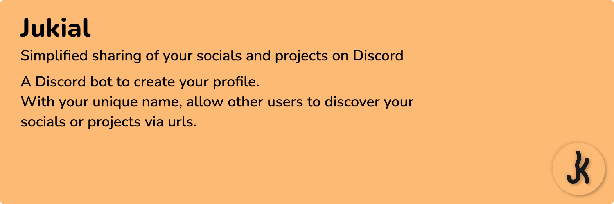

# Jukial Bot

## Stack

- [Discord.js](https://discord.js.org) - Module that allows to interact with the Discord API.
- [Typeorm](https://typeorm.io) - It is an ORM that can run in Node.js.
- [Capistrano](https://capistranorb.com) - It is written in Ruby, but it can easily be used to deploy any language.

## Author

**Jukial** © [Natchii59](https://github.com/Natchii59).

Authored and maintained by Natchii59.

> Github [@Natchii59](https://github.com/Natchii59)

> Website [natchi.fr](https://www.natchi.fr)
